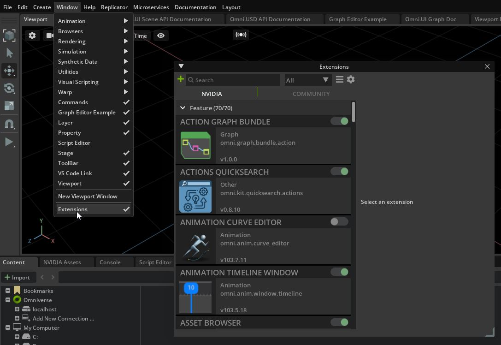
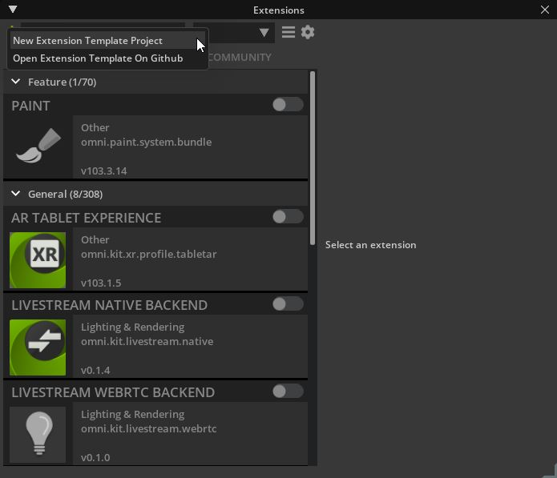
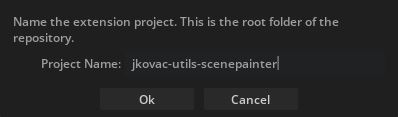
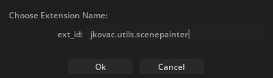
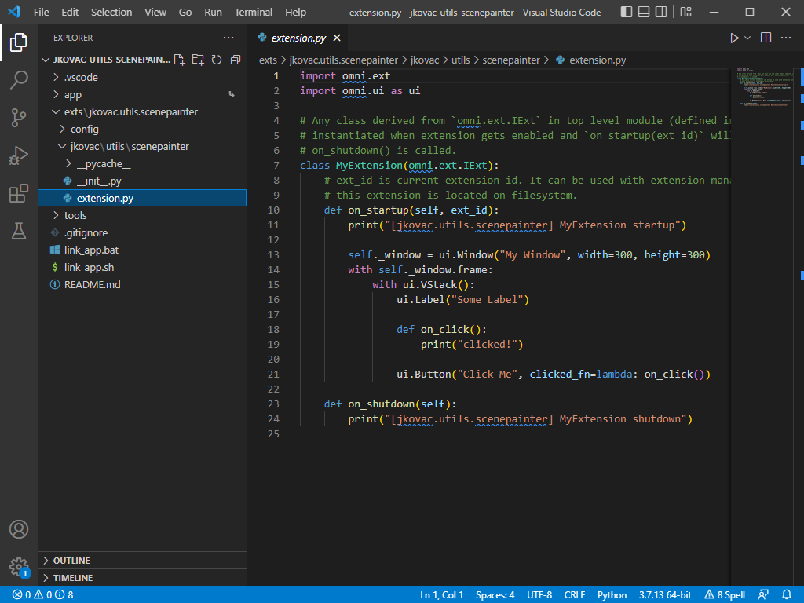

<!-- markdownlint-disable -->
<h1 align="center">
    NVIDIA Omniverse Extension Publishing
</h1>
<h3 align="center">
    Expand your audience with Omniverse
</h3>

Whether you’re an independent developer building a tool for a specific task, or an enterprise developer creating a digital twin, you need to build the tools and workflows to get the job done. Below you can find resources and instructions in reaching new audiences with Omniverse.

     

## Getting Started    

  
Expand for steps on Getting Started

Ready to build your first extension? Check out the steps below to get up and running in no time. 

Once you're ready to share with the world, you can publish your extension to the community via GitHub - instructions can be found below.

### Installation Prerequisites  
:heavy_check_mark: Install [NVIDIA Omniverse](https://www.nvidia.com/en-us/omniverse/download/)  
:heavy_check_mark: Install [Omniverse Code](https://developer.nvidia.com/nvidia-omniverse-platform/code-app)  
:heavy_check_mark: Install [Visual Studio Code](https://code.visualstudio.com/download)  

### Building Your First Extension  
Once the steps above are complete, getting started is easy. Simply launch Omniverse Code from the NVIDIA Omniverse Launcher, then navigate to the Extensions tab.  

Click the green + icon in the top left corner to create an extension from the template.  

Choose the directory you'd like to create your extension, then provide a folder & project namespace to complete the project.  

Visual Studio Code should automatically open with your newly created project, and you're ready to begin developing your first extension! Navigate to `exts\[your.project.namespace]\your\project\namespace\extension.py` to review the placeholder code and observe the extension window that is now open in Omniverse Code.  

You can also check out our [Spawn Primitives Extension Sample](https://github.com/NVIDIA-Omniverse/kit-extension-sample-spawn-prims) tutorial for getting up and running within 10 minutes.  

  

## Samples & Resources  

  
Expand for resources that will help accelerate your learning journey.

### Extension Samples  
Kit comes bundled with a number of extensions, which can be found inside `app/kit/exts`, `app/kit/extscore`, and `app/exts`. Most of these are in Python, and the source is available for your continued learning

**Layout & Scene Authoring Samples**  
* [Spawn Primitives Sample](https://github.com/NVIDIA-Omniverse/kit-extension-sample-spawn-prims) - Leverage the Command tab to spawn a set of primitives within your scene
* [Scatter Tool Sample](https://github.com/NVIDIA-Omniverse/kit-extension-sample-scatter) - Randomly distribute primitives within a given bounds
* [CSV Reader Sample](https://github.com/NVIDIA-Omniverse/kit-extension-sample-csv-reader) - Learn how to populate a scene using data from a CSV file
 
**Scene Modifier, Manipulator Tool Samples**  
* [Viewport Info & Manipulator Samples](https://github.com/NVIDIA-Omniverse/kit-extension-sample-ui-scene) - A collection of samples demonstrating how to render additional metadata and create custom manipluators within the Omniverse viewport
* [Viewport Reticle Sample](https://github.com/NVIDIA-Omniverse/kit-extension-sample-reticle) - Use `omni.scene.ui` to draw GUI reticles & compositions within the Omniverse viewport

**Styling Samples**  
* [UI Window Samples](https://github.com/NVIDIA-Omniverse/kit-extension-sample-ui-window) - A collection of samples demonstrating how to layout and style custom dialog windows using Omniverse Kit

### Technical Documentation  
* [Omniverse Code Overview](https://www.youtube.com/watch?v=j1Pwi1KRkhk) - The Omniverse Code app contains interactive documentation experimenting with key building blocks available in Kit
* [Python Kit API Reference & Technical Documentation](https://docs.omniverse.nvidia.com/py/kit/index.html)
* [NVIDIA Omniverse Resource Center - Extensions](https://developer.nvidia.com/nvidia-omniverse-developer-resource-center#extensions) - includes videos and additional resources for learning how to develop extensions

### Additional Resources  

We have a fantastic community of active developers in our forums and the official Omniverse Discord channel. See the links below for support and connecting with the broader Omniverse developer community:
* [Omniverse Extension Forums](https://forums.developer.nvidia.com/c/omniverse/extension/399)
* [NVIDIA Omniverse Discord](https://forums.developer.nvidia.com/t/omniverse-discord-server-is-live/178422)

  

## Publishing Your Extension to the Extension Manager
Below is a high level checklist of what you'll need to do in order for your extension to be easily accessible to the Omniverse community.

### Prepare    
:heavy_check_mark: Developer & test your extension  
:heavy_check_mark: Update your `extension.toml` config file found in `exts\[project]\config`  
:heavy_check_mark: Update your extension's `README.md` & `CHANGELOG.md` found in `exts\[project]\docs`  
:heavy_check_mark: Update your extension's icon.png & preview.png images found in `exts\[project]\data`  
### Publish  
:heavy_check_mark: Publish your project to a public repo on GitHub. Ensure your repo's `root` directory contains the `exts\` folder (see our [template](https://github.com/NVIDIA-Omniverse/kit-extension-template) as an example)  
:heavy_check_mark: Add the `omniverse-kit-extension` [Topic](https://docs.github.com/en/repositories/managing-your-repositorys-settings-and-features/customizing-your-repository/classifying-your-repository-with-topics) to your repo so that it shows up [here](https://github.com/topics/omniverse-kit-extension)  
:heavy_check_mark: Publish a [Release](https://docs.github.com/en/repositories/releasing-projects-on-github/managing-releases-in-a-repository) for your project    

### Troubleshooting  
* Please allow up to 2 days for your extension to be discoverable in the Extension Manager's Community section.
* Ensure your extension follows the folder structure mentioned above, and be sure to follow namespacing standards: `companyname.category.appname`
* Download and unzip your release's `source.zip` file to ensure the the root directory contains the `exts\` folder

## *NEW* Publishing Your Extension on the Omniverse Exchange
Looking to broaden your reach even more? We are now taking sign-ups for the community to publish directly to the Omniversee Exchange! See the [Omniverse Exchange Publishing Early Access Program](https://developer.nvidia.com/omniverse-exchange-publishing-portal) for more details.
